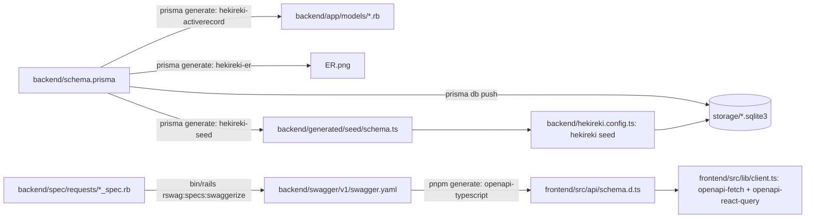
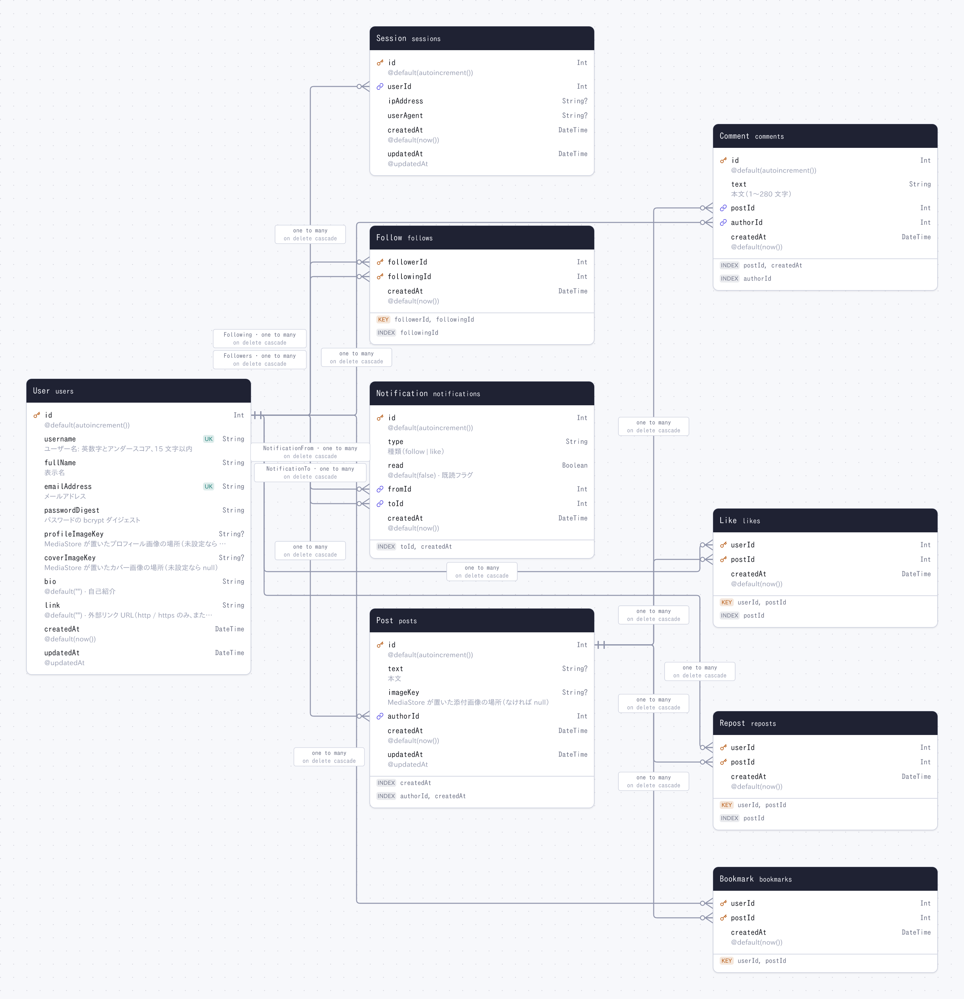

# react-rails-x

学習用の X（Twitter）クローンです。React のフロントエンドが Rails の REST API と、Rails 自身が書き出す OpenAPI の契約を介して会話します。


```
frontend/   React 19 + Vite+（vp: dev / build / fmt / lint / check）+ TanStack Router / Query / Form + openapi-fetch + openapi-react-query
backend/    Rails 8.1（API モード）+ SQLite + hekireki（schema.prisma → app/models, ER.png, seed）+ RSpec + rswag + RuboCop（rails-omakase）
```

## 全体の流れ



- **データモデルの正典は `schema.prisma` だけです。** [hekireki](https://github.com/nakita628/hekireki) がそこから
  `app/models`（バリデーションとそのメッセージ、関連、`has_secure_password`、scope、画像のコールバック）、
  ER 図、seed 用スキーマを書き出し、テーブルは Prisma が作ります。Rails 側に migration と `schema.rb` はありません
  （`config.active_record.migration_error = false`）。`app/models` は手で編集せず、モデルに足したいものは
  schema.prisma の `/// @ar.` 行に書きます。開発用データは `backend/hekireki.config.ts` に行として書き、
  `hekireki seed` が投入します。
- **バリデーションは Active Record（モデル）の責務です。** ルールとメッセージはすべて schema.prisma 由来のモデルに
  あり、画像アップロードも仮想属性に対する `@ar.validate` 行です。行にならない一覧のクエリパラメータ
  （page / rows / feed）だけはコントローラーで確かめ、同じ形の 422 にします。失敗はどれも 422 で、`errors` に
  フィールド名とメッセージが並びます。生の SQL は書かず、フィードは Active Record のリレーションを Ruby で
  マージして組み立てます。
- **ブラウザからの確認は Playwright です。** `frontend/e2e/auth.spec.ts` がサインアップ・サインイン・
  サインアウトを実際のブラウザで通します。`playwright.config.ts` が e2e 専用の Rails（:3001、
  `storage/e2e.sqlite3`）と Vite（:5174）を起動するので、開発中のデータベースには触れません。
- **request spec がそのまま OpenAPI です。** Rails でテストから OpenAPI を生成する定番の
  [rswag](https://github.com/rswag/rswag) を使い、`backend/spec/requests` の spec が全エンドポイントを叩いて、
  レスポンスを `spec/swagger_helper.rb` の components（example 付き）と照合します。
  `bin/rails rswag:specs:swaggerize` が `swagger/v1/swagger.yaml` を書き出し、Swagger UI が
  http://localhost:3000/api-docs で表示します。データは Rails の fixtures（`spec/fixtures/*.yml`）で、
  `spec/models` がバリデーションとメッセージを確かめます。
- **フロントの型はその文書から生成します。** [openapi-typescript](https://openapi-ts.dev/ja/introduction) が
  `src/api/schema.d.ts` を書き、[openapi-fetch](https://openapi-ts.dev/ja/openapi-fetch/) と
  [openapi-react-query](https://openapi-ts.dev/ja/openapi-react-query/) がそれを使うので、パス・パラメータ・
  ボディ・レスポンスが契約からずれると型エラーになります。
- **認証は `rails generate authentication` の形です。** `has_secure_password`、サインインしたブラウザごとの
  `Session` 行、署名付き `session_id` cookie、`Current.user`。Vite の dev サーバーが `/api` を Rails に
  プロキシするので cookie は同一オリジンです。
- **エラーは RFC 9457 の problem document**（`application/problem+json`）で、`status` を持ちます。

## データモデル

`backend/` で `pnpm generate` を実行すると、hekireki-er が `schema.prisma` からプロジェクトルートに生成します。



`users` がサインインし（ブラウザごとに `sessions` の行）、`posts` を書きます。`comments`・`likes`・`reposts`・
`bookmarks` は投稿にぶら下がり、`follows` と `notifications` はユーザー同士を結びます。`*_key` 列は
`MediaStore` がアップロード画像をディスクのどこに置いたかで、画像そのものは `/api/media` が配信します。

## はじめかた

Ruby 4 / Rails 8.1、Node 24、pnpm が必要です。

```sh
make setup   # backend: bundle + pnpm install, prisma generate, prisma db push（dev と test）, seed / frontend: pnpm install, 型生成
make dev     # Rails API（http://localhost:3000）と Vite（http://localhost:5173）を同時に起動
```

`hekireki seed`（`make setup` が実行。`backend/` で `pnpm seed` でも可）が `alice`・`bob`・`carol` を作ります。
パスワードはいずれも `secret123` で、投稿・いいね・リポスト・フォローがいくつか入っています。

## API を変えるとき

1. データモデルやバリデーションが変わるなら `backend/schema.prisma` を編集し、`backend/` で
   `pnpm generate && pnpm db:push`（と `pnpm db:push:test`）。`app/models`、`ER.png`、seed 用スキーマが書き直されます。
2. コントローラー（JSON の形は `app/controllers/concerns/representations.rb`）と、`backend/spec/requests` の spec を変えます。
3. `SWAGGER_DRY_RUN=0 bin/rails rswag:specs:swaggerize` で spec を実行しつつ `swagger/v1/swagger.yaml` を書き直します。
4. `frontend/` で `pnpm generate` が `src/api/schema.d.ts` を書き直し、`pnpm check` が壊れた呼び出し側を全部示します。

## コマンド

`make dev` / `make setup` / `make test` / `make e2e` / `make format` / `make generate` は両側をまとめて実行します。個別には次のとおりです。

| | backend | frontend |
| --- | --- | --- |
| 起動 | `bin/dev` | `pnpm dev` |
| テスト | `bin/rspec` | `pnpm check`（fmt + lint + 型検査）、`pnpm test:e2e`（Playwright。初回は `pnpm exec playwright install chromium`） |
| フォーマット / lint | `bin/rubocop -a`（rubocop-rails-omakase） | `pnpm fmt`（oxfmt）/ `pnpm lint`（oxlint）、まとめて `pnpm check --fix` |
| 生成 | `pnpm generate`（models, ER.png, seed 用スキーマ）, `SWAGGER_DRY_RUN=0 bin/rails rswag:specs:swaggerize`（OpenAPI） | `pnpm generate`（型） |
| データ | `pnpm seed`（hekireki seed）, `pnpm studio`（Hekireki Studio） | |
